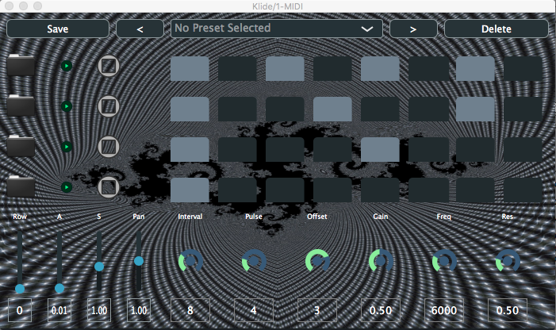

# Klide

Klide is an audio VST3 plugin, made with Juce in C++17.
It's a sampler and drum machine, that can create polyrhythms.
It's based on Bjorklund's Euclidean Algorithm and [Toussaint's paper](http://cgm.cs.mcgill.ca/~godfried/publications/banff.pdf).

For now the plugin can play 4 sequences simultaneously. For each sequence a sample can be chosen by the user. Only wav files are supported for now.

Under the sequences there are some sliders.
The first one on the left allows to choose which sequence, which row, will be controlled by the other slider at its right, so :

- The attack of the sample
- The sustain of the sample

- The number of intervals, or steps that can be played
- The number of pulses that will be played in this sequence, as calculated by the Euclidean Algorithm
Which means that the pulses will be put as evenly as possible on the number of steps chosen
- The offset, which offsets the sequence calculated

- The Gain for the sample
- The Frequency of the low pass filter for this sample
- The Resonance of the low pass filter for this sample

